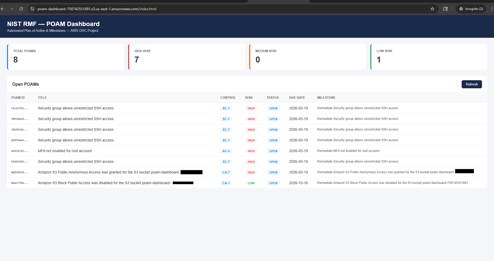
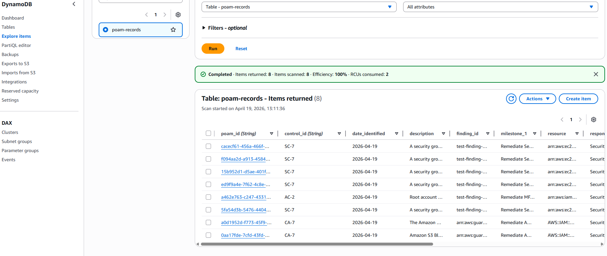
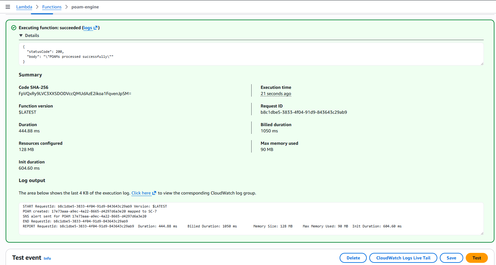
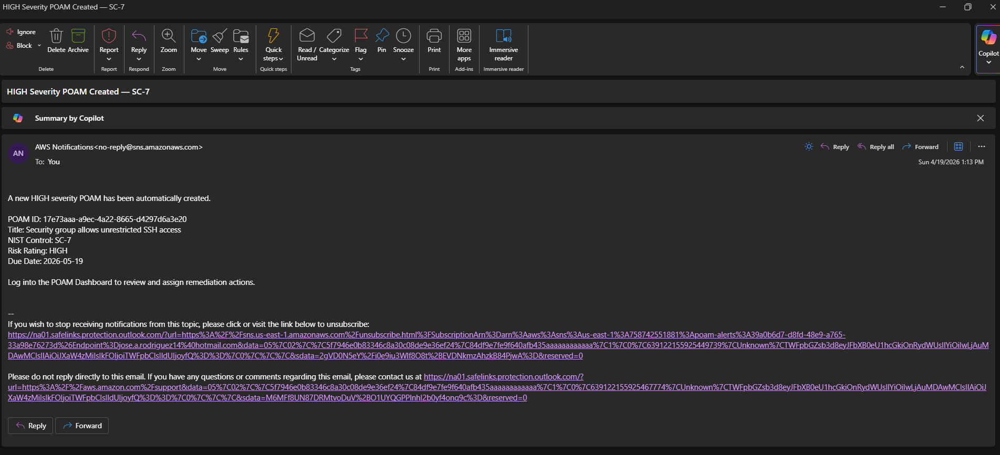
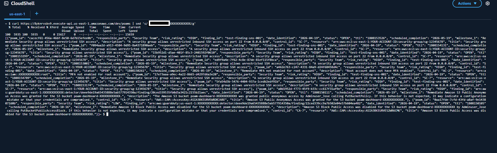
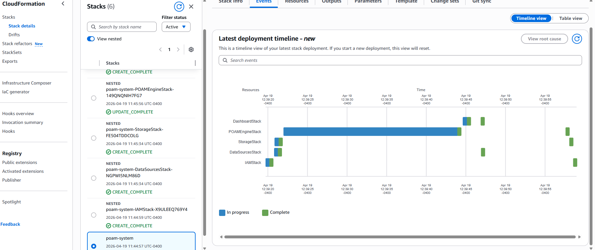
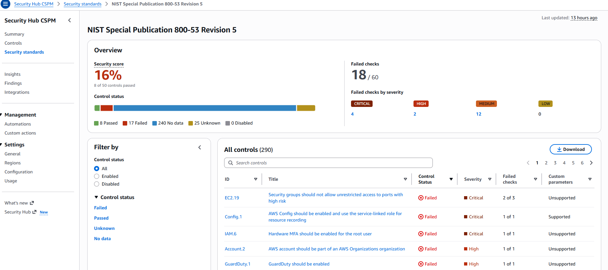
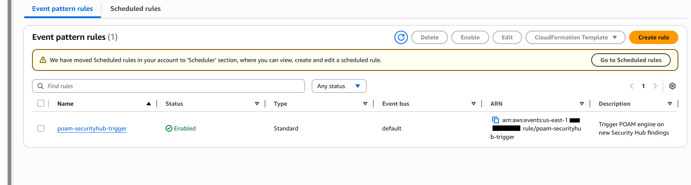

# NIST RMF Automated POAM System
### AWS GRC Engineering Portfolio Project


---

## Overview

A fully automated Plan of Action and Milestones (POAM) system built on AWS 
that demonstrates practical NIST Risk Management Framework (RMF) 
implementation. The system automatically ingests security findings from AWS 
Security Hub and GuardDuty, maps them to NIST SP 800-53 controls, generates 
POAMs, and notifies stakeholders — all within the AWS free tier.

---

## Architecture

```
Security Hub / GuardDuty
        ↓
   EventBridge (event bus)
        ↓
   Lambda (POAM engine)
        ↓
  ┌─────┴──────┐
  │            │
DynamoDB      SNS
(POAM store)  (email alerts)
  │
  └──── API Gateway ──── S3 Dashboard
```

---

## Features

- **Automated POAM generation** — new Security Hub findings automatically create POAMs within minutes
- **NIST SP 800-53 control mapping** — findings mapped to control families (AC, AU, CA, CM, IA, IR, RA, SC, SI)
- **Risk-based milestones** — HIGH (30 days), MEDIUM (90 days), LOW (180 days)
- **REST API** — query POAMs programmatically via API Gateway
- **Web dashboard** — visual POAM management interface
- **Email alerts** — SNS notifications for HIGH severity POAMs
- **Infrastructure as Code** — fully deployed via CloudFormation nested stacks
- **Free tier** — runs entirely within AWS free tier limits

---

## NIST RMF Coverage

| RMF Step | Implementation |
|---|---|
| Categorize | FIPS 199 — Moderate impact (documented in SSP) |
| Select | NIST SP 800-53 standard enabled in Security Hub |
| Implement | CloudFormation templates as baseline configuration evidence |
| Assess | Security Hub continuous assessment against NIST controls |
| Authorize | SSP, POAM exports, and CloudTrail logs as ATO artifacts |
| Monitor | EventBridge + Lambda continuous monitoring pipeline (CA-7) |

---

## AWS Services Used (Free Tier)

| Service | Purpose | Free Tier Limit |
|---|---|---|
| Lambda | POAM engine and API handler | 1M requests/month |
| DynamoDB | POAM record storage | 25 GB |
| EventBridge | Finding ingestion trigger | 1M events/month |
| API Gateway | REST API for dashboard | 1M calls/month |
| S3 | POAM exports and dashboard | 5 GB |
| SNS | Email notifications | 1M publishes/month |
| Security Hub | Finding aggregation | 30-day free trial |
| GuardDuty | Threat detection | 30-day free trial |
| CloudTrail | Audit logging | 1 trail free |
| IAM | Access control | Always free |

---

## Project Structure

```
poam-system/
├── cloudformation/
│   ├── root-stack.yaml
│   └── stacks/
│       ├── 01-iam-roles.yaml
│       ├── 02-data-sources.yaml
│       ├── 03-storage.yaml
│       ├── 04-poam-engine.yaml
│       ├── 05-api-dashboard.yaml
│       └── 06-notifications.yaml
├── lambda/
│   ├── poam_engine.py
│   ├── control_mapper.py
│   ├── poam_exporter.py
│   └── poam_api.py
├── dashboard/
│   └── index.html
├── docs/
│   ├── system-security-plan.md
│   └── screenshots/
│       ├── 01-poam-dashboard.png
│       ├── 02-dynamodb-records.png
│       ├── 03-lambda-test.png
│       ├── 04-sns-email.png
│       ├── 05-api-response.png
│       ├── 06-cloudformation-stacks.png
│       ├── 07-security-hub.png
│       └── 08-eventbridge-rule.png
└── README.md
```

---

## Deployment Guide

### Prerequisites
- AWS Account
- AWS CLI installed and configured
- Python 3.12
- VS Code or any text editor

### Step 1 — Create artifact bucket
```bash
aws s3 mb s3://YOUR-ARTIFACT-BUCKET-NAME
```

### Step 2 — Package Lambda functions
```powershell
Compress-Archive -Path lambda\* -DestinationPath lambda\poam_engine.zip
```

### Step 3 — Upload artifacts to S3
Upload the following to your artifact bucket:
- `lambda/poam_engine.zip` → `YOUR-BUCKET/lambda/`
- All yaml files from `cloudformation/stacks/` → `YOUR-BUCKET/stacks/`

### Step 4 — Update configuration
In `root-stack.yaml` replace all TemplateURL values with your bucket name:
```yaml
TemplateURL: 'https://YOUR-BUCKET.s3.us-east-1.amazonaws.com/stacks/01-iam-roles.yaml'
```

In `index.html` replace the API URL:
```javascript
const API_URL = 'https://YOUR-API-GATEWAY-URL/dev/poams';
```

### Step 5 — Deploy via CloudFormation console
1. Go to AWS Console → CloudFormation → Create stack
2. Upload `root-stack.yaml`
3. Enter stack name `poam-system`
4. Enter your notification email
5. Acknowledge IAM capabilities
6. Click Submit

### Step 6 — Enable Security Hub
1. Go to Security Hub → Enable
2. Enable NIST SP 800-53 standard
3. Enable AWS Foundational Security Best Practices

### Step 7 — Test the system
Run a test finding via Lambda console using this test event:
```json
{
  "detail": {
    "findings": [
      {
        "Id": "test-finding-001",
        "Title": "MFA not enabled for root account",
        "Description": "Root account does not have MFA enabled",
        "Severity": {
          "Label": "HIGH"
        },
        "Compliance": {
          "SecurityControlId": "IAM.1"
        },
        "Resources": [
          {
            "Id": "arn:aws:iam::YOUR-ACCOUNT-ID:root"
          }
        ]
      }
    ]
  }
}
```

---

## POAM Data Model

```json
{
  "poam_id": "uuid",
  "control_id": "AC-2",
  "status": "OPEN",
  "risk_rating": "HIGH",
  "finding_id": "security-hub-finding-arn",
  "title": "Finding title",
  "description": "Finding description",
  "resource": "affected-aws-resource",
  "scheduled_completion": "2026-05-19",
  "milestone_1": "Remediation action",
  "responsible_party": "Security Team",
  "date_identified": "2026-04-19"
}
```

---

## NIST SP 800-53 Control Mapping

| Security Hub Control | NIST Control | Family |
|---|---|---|
| IAM.1, IAM.2 | AC-2 | Access Control |
| IAM.3, IAM.7 | IA-5 | Identification & Auth |
| S3.1, EC2.1 | SC-7 | System & Comms Protection |
| S3.4, RDS.1 | SC-28 | Protection at Rest |
| CloudTrail.1 | AU-2 | Audit & Accountability |
| Config.1 | CM-8 | Configuration Management |
| GuardDuty.1 | SI-4 | System & Info Integrity |
| SecurityHub.1 | CA-7 | Security Assessment |

---

## GRC Skills Demonstrated

- NIST RMF lifecycle implementation (all 6 steps)
- POAM creation and management
- Security control mapping (FSBP → NIST SP 800-53)
- Continuous monitoring architecture (CA-7)
- System Security Plan (SSP) documentation
- Infrastructure as Code (CloudFormation)
- Least privilege IAM design
- Automated compliance pipeline design
- ATO artifact generation

---

## Screenshots

| Screenshot | Description |
|---|---|
|  | POAM web dashboard |
|  | POAM records in DynamoDB |
|  | Lambda test execution |
|  | HIGH severity email alert |
|  | API Gateway curl response |
|  | CloudFormation stacks |
|  | Security Hub NIST standard |
|  | EventBridge rule |

---

## License
MIT License — feel free to use this project as a reference for your own 
GRC portfolio.
